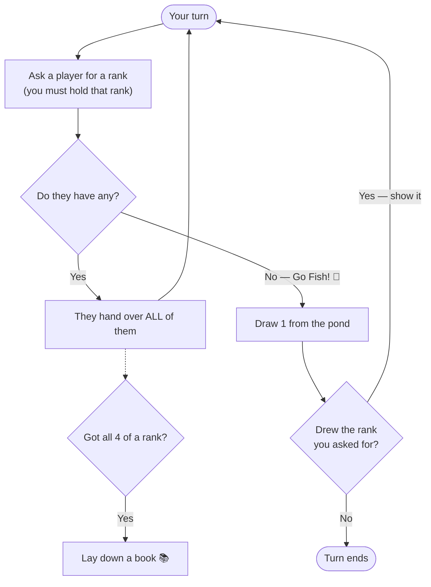

# 🐠 Go Fish

> The perfect starter card game. Ask for cards, collect sets of 4, try not to go "fishing."

| 👥 Players | 🃏 Deck | ⏱️ Time | ⭐ Difficulty |
|:----------:|:------:|:------:|:------------:|
| 2–6 | 52 cards | 10–20 min | Easy |

---

## 🎯 Goal

**Collect the most "books"** — sets of 4 cards of the same rank.

---

## 🃏 Setup

| Players | Cards each |
|:-------:|:----------:|
| 2–3 | 7 |
| 4–6 | 5 |

Remaining cards go face-down in the middle as the **"pond."**

---

## 🎮 How to Play

On your turn:

1. **Pick a player** and ask: *"Do you have any sevens?"* (or any rank).
   - 🛑 You must already hold at least one card of that rank.
2. If they have any → they give you **ALL** of them → you go again.
3. If they don't → they say **"Go Fish!"** → you draw one card from the pond.
   - 🎣 If you drew the rank you asked for, show it and go again.
   - Otherwise, your turn ends.

Whenever you collect **all 4** of a rank, lay them face-up as a **book** in front of you.

### 🔄 Turn Flow

---

## 🏁 Game End

The game ends when:
- All 13 books have been collected, **or**
- The pond runs out and players empty their hands.

**Most books wins!**

---

## 💡 Strategy Tips

- 🧠 **Remember what others ask for** — they have those ranks.
- 🎯 **Target players who recently asked** for cards you might want to ask about later.
- 🤫 **Don't reveal more than needed** — answer just yes or no.

---

## ⚠️ Common Mistakes

- ❌ Asking for a rank you don't already hold (illegal!)
- ❌ Forgetting to "go again" after a successful match

---

## 👶 Great For

Kids, beginners, and warming up before a longer game night.

---

[← Back to all games](../README.md)
