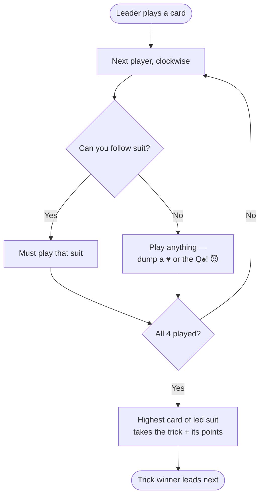

# ♠️ Hearts

> A classic trick-taking game where you want **fewer** points, not more. Avoid Hearts and dodge the Queen of Spades!

| 👥 Players | 🃏 Deck | ⏱️ Time | ⭐ Difficulty |
|:----------:|:------:|:------:|:------------:|
| 4 (best) | 52 cards | 30–60 min | Medium |

---

## 🎯 Goal

**Score the FEWEST points.** Game ends when someone hits 100 — lowest score wins.

---

## 💔 Penalty Cards

| Card | Points |
|:----:|:------:|
| Each ♥ Heart | **1 point** |
| ♠ Queen of Spades | **13 points** 😱 |

Everything else: 0 points.

---

## 🃏 Setup

1. Deal all 52 cards — **13 to each player**.
2. **Pass 3 cards** to another player before play starts:
   - Round 1 → pass **left**
   - Round 2 → pass **right**
   - Round 3 → pass **across**
   - Round 4 → **no pass** (keep your hand)
   - Cycle repeats.

---

## 🎮 How to Play

1. Player with the **2 of Clubs** leads it to start the first trick.
2. Going clockwise, each player plays one card. **You must follow suit** if possible.
3. If you can't follow suit, play any card (this is your chance to dump Hearts or the ♠Q).
4. Highest card of the led suit wins the **trick**.
5. Winner of the trick leads the next one.

> 🚫 **You cannot lead Hearts** until Hearts have been "broken" — meaning, until someone has played one because they couldn't follow suit.

### 🔄 Trick Flow

---

## 🌙 Shoot the Moon!

If you collect **ALL 13 Hearts + the Queen of Spades** in one round, instead of 26 points to you:

✨ **All other players get 26 points each.** ✨

A massive risk-reward play. Usually you should try to block someone you suspect of shooting.

---

## 🏆 Scoring

After each round, total each player's penalty cards. **Game ends when any player reaches 100 points.** Lowest score wins.

---

## 💡 Strategy Tips

- 🗡️ **Pass dangerous cards** — high spades (A, K, Q), high hearts, voids in a suit you want to dump.
- 🎯 **Try to be "void"** in a suit early so you can dump hearts/♠Q later.
- 👑 **Watch for the Queen of Spades** — if you have it, play it on the highest spade trick you can.
- 🌙 **Spot the moon shoot** — if one player is taking every heart, you may need to let them win the ♠Q to break it.

---

## ⚠️ Common Mistakes

- ❌ Leading Hearts before they're broken
- ❌ Holding onto the Queen of Spades when you should be dumping her
- ❌ Forgetting which direction to pass

---

[← Back to all games](../README.md)
