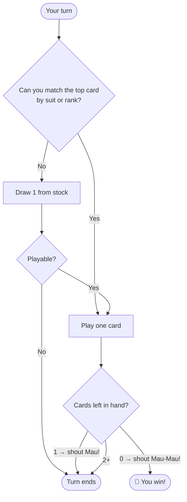

# 🎴 Mau-Mau

> A fast, friendly shedding game where the first to ditch all their cards wins. The ancestor of UNO.

| 👥 Players | 🃏 Deck | ⏱️ Time | ⭐ Difficulty |
|:----------:|:------:|:------:|:------------:|
| 2–6 | 32 or 52 cards | 15–30 min | Easy |

---

## 🎯 Goal

**Be the first player to get rid of all your cards.**

---

## 🃏 Setup

1. Use a standard 52-card deck (or 32-card German deck — 7s through Aces).
2. Deal **5 cards** to each player.
3. Place the rest face-down as the **stock pile**.
4. Flip the top card face-up next to it — that starts the **discard pile**.

---

## 🎮 How to Play

On your turn, you must play **one card** that matches the top of the discard pile by either:

- ✅ **Same suit** (e.g. ♥ on ♥)
- ✅ **Same rank** (e.g. 7 on 7)

If you can't play, **draw one card** from the stock. If it's playable, you may play it immediately; otherwise, your turn ends.

### 🔄 Turn Flow

> 🔔 **The Mau-Mau rule:** When you play your **second-to-last** card, you must shout **"Mau!"**. When you play your **last** card, shout **"Mau-Mau!"**. Forget? Draw 2 cards as a penalty.

---

## ⚡ Special Cards (the fun part)

| Card | Effect |
|:----:|--------|
| **7** | Next player draws **2 cards** (stacks if they also play a 7 → draws 4, 6, 8…) |
| **8** | Next player **skips** their turn |
| **9** | **Reverses** direction of play |
| **J (Jack)** | Wild — change the suit to anything you choose |
| **A (Ace)** | Player gets **another turn** |

> ℹ️ Regional variants change which cards do what. Agree before you start!

---

## 🏆 Scoring (optional)

When someone goes out, others count points of cards still in hand:

- Number cards = face value
- J / Q / K = 10 points
- A = 11 points

Lowest total after several rounds wins. Or just play "first to win 3 rounds."

---

## 💡 Strategy Tips

- 🎯 **Save your Jacks** — wild cards are powerful late-game.
- 🔥 **Stack 7s** to dump a big penalty on someone.
- 👀 **Watch what suits opponents avoid** — they probably don't have them.
- ⏰ **Don't forget to say Mau!** — it's the #1 way people lose.

---

## ⚠️ Common Mistakes

- ❌ Forgetting to say "Mau" on your second-to-last card
- ❌ Playing a Jack and forgetting to call a new suit
- ❌ Not stacking a 7 when you have one (you eat the penalty instead!)

---

[← Back to all games](../README.md)
