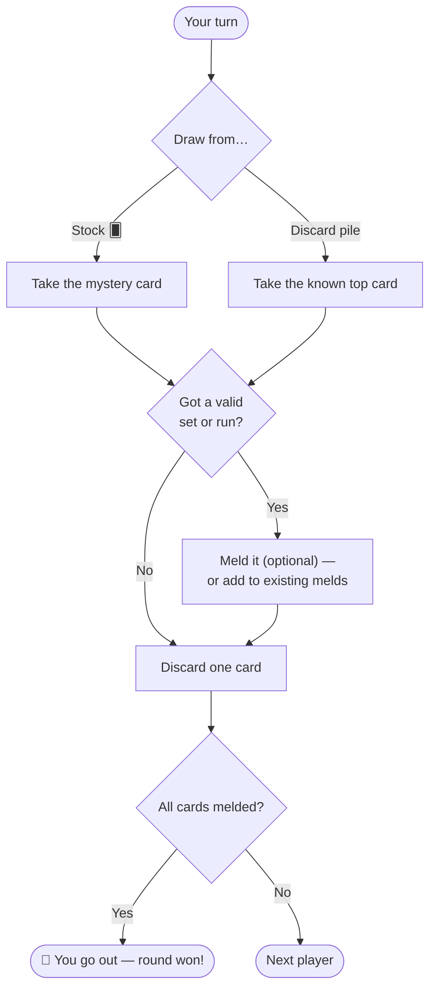

# 🂡 Rummy

> Match, meld, and discard. One of the world's most popular card game families — easy to learn, deep to master.

<div align="center">

| 👥 Players | 🃏 Deck | ⏱️ Time | ⭐ Difficulty |
|:----------:|:------:|:------:|:------------:|
| 2–6 | 52 cards | 20–45 min | Medium |

</div>

---

## 🎯 Goal

**Be the first to "go out" by melding all your cards** into valid sets and runs.

---

## 🃏 Setup

| Players | Cards each |
|:-------:|:----------:|
| 2 | 10 |
| 3–4 | 7 |
| 5–6 | 6 |

1. Deal cards as above.
2. Remaining cards form the **stock**, face-down.
3. Flip the top card face-up to start the **discard pile**.
4. Ace ranks **low** (A-2-3 is a valid run).

---

## 🧩 What Counts as a Meld?

You build two kinds of combinations:

### 🔢 Set (Group)
Three or four cards of the **same rank**, different suits.

```
   ┌─────┐  ┌─────┐  ┌─────┐
   │7 ♠  │  │7 ♥  │  │7 ♦  │   ← valid set
   └─────┘  └─────┘  └─────┘
```

### 🔗 Run (Sequence)
Three or more **consecutive** cards of the **same suit**.

```
   ┌─────┐  ┌─────┐  ┌─────┐  ┌─────┐
   │5 ♣  │  │6 ♣  │  │7 ♣  │  │8 ♣  │   ← valid run
   └─────┘  └─────┘  └─────┘  └─────┘
```

---

## 🎮 How to Play

Each turn has **3 steps**:

1. **Draw** — take one card from the stock OR the top of the discard pile.
2. **Meld (optional)** — lay down any valid set/run, or add cards to existing melds (yours or others, depending on variant).
3. **Discard** — place one card face-up on the discard pile. Turn ends.

When a player has melded all their cards (with one card to discard last), they **"go out"** and win the round.

### 🔄 Turn Flow



---

## 🏆 Scoring

When someone goes out, opponents score penalty points for cards left in hand:

| Card | Points |
|:----:|:------:|
| 2–10 | Face value |
| J / Q / K | 10 each |
| A | 1 (low) or 15 (high) — agree first |

Game often ends when someone reaches **100 or 500 points** (loser high) — adjust to taste.

---

## 💡 Strategy Tips

- 🎯 **Plan two melds at once** — keep cards that could go either way.
- 🗑️ **Watch the discard pile** — never feed opponents the card they're collecting.
- ⚡ **Go out fast in early rounds** — penalty points add up.
- 🃏 **Don't hoard high cards** (J/Q/K) — they're 10 points each if caught.

---

## 🌍 Popular Variants

- **Gin Rummy** — 2 players, 10 cards each, "knock" when unmelded points ≤ 10.
- **Rummy 500** — meld onto opponents' sets; play to 500 points.
- **Canasta** — uses 2 decks + jokers, focused on 7-card "canastas."
- **Indian Rummy** — 13 cards, includes a wildcard joker.

---

## ⚠️ Common Mistakes

- ❌ Drawing from the discard pile without a plan
- ❌ Forgetting to discard at the end of your turn
- ❌ Melding too early and showing your hand

---

[← Back to all games](../README.md)
