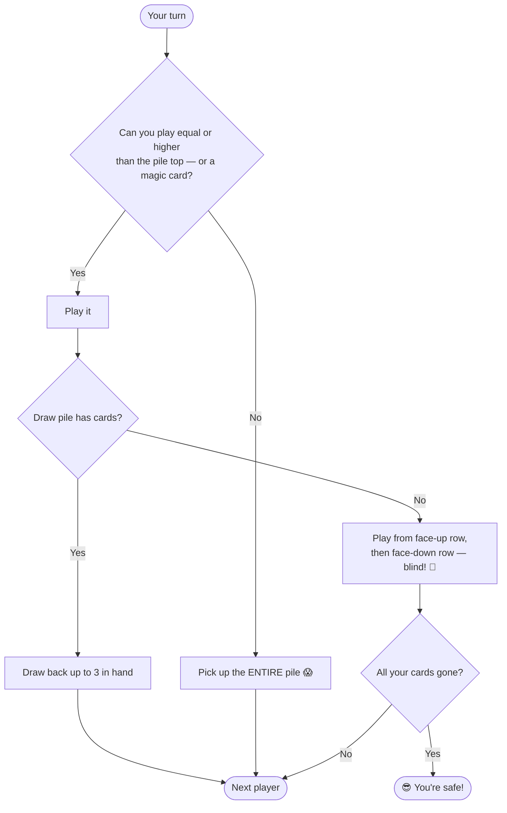

# 💩 Shithead

> A chaotic, hilarious shedding game. Last player holding cards is the "shithead" and deals next round.

<div align="center">

| 👥 Players | 🃏 Deck | ⏱️ Time | ⭐ Difficulty |
|:----------:|:------:|:------:|:------------:|
| 2–5 | 52 cards | 15–30 min | Medium |

</div>

---

## 🎯 Goal

**Get rid of all your cards. Don't be the last one holding any.**

---

## 🃏 Setup

Each player gets **9 cards** in three rows:

```
     ┌──┐ ┌──┐ ┌──┐
     │??│ │??│ │??│   ← Face-down (can't look)
     └──┘ └──┘ └──┘
     ┌──┐ ┌──┐ ┌──┐
     │5♦│ │J♠│ │8♥│   ← Face-up (everyone sees)
     └──┘ └──┘ └──┘
     ┌──┐ ┌──┐ ┌──┐
     │ A│ │ 2│ │ K│   ← Your hand (you see)
     └──┘ └──┘ └──┘
```

1. Deal 3 face-down cards (don't peek!).
2. Deal 3 face-up cards on top of those.
3. Deal 3 cards to each player's hand.
4. Before play starts, swap any hand cards with your face-up cards to optimize.
5. Remaining cards form the **draw pile**.

---

## 🎮 How to Play

Play moves clockwise. On your turn, play **a card equal to or higher than** the top of the discard pile.

- Always keep **3 cards in hand** by drawing from the draw pile after playing.
- Can't play? **Pick up the entire discard pile** into your hand. 😱
- Once the draw pile is empty, play through your face-up row, then face-down row (you flip these blind!).

### 🔄 Turn Flow



---

## ⚡ Magic Cards

| Card | Effect |
|:----:|--------|
| **2** | Reset — next player can play anything |
| **7** | Next player must play **7 or lower** |
| **8** | Invisible — next player matches the card **under** the 8 |
| **10** | **Burns** the pile — discard it all, same player goes again |
| **4 of same rank** | Burns the pile (any time, even mid-stack) |

> 🔥 **Burn the pile = it's gone forever.** A powerful escape from a high stack.

---

## 🏁 The Endgame

Once your hand and face-up cards are gone, you play **face-down cards blind**:

1. Flip one without looking.
2. If it's playable → you played it!
3. If it's not → pick up the pile and resume normal play with that card in hand.

**Last player still holding cards = the Shithead.** 💩 They deal next round (and endure the shame).

---

## 💡 Strategy Tips

- 🎯 **Save your 2s, 10s, and Jokers** for emergencies (escape big piles).
- 👀 **Watch what's face-up** in front of opponents — they're stuck playing those eventually.
- 🔥 **Burn the pile when it gets high** — don't let yourself be forced to pick it up.
- 🃏 **Swap weak hand cards into face-up** before play starts.

---

## ⚠️ Common Mistakes

- ❌ Looking at your face-down cards (you can't!)
- ❌ Wasting 10s early when the pile is small
- ❌ Forgetting to draw back up to 3 cards

---

## 🌍 Variants

Also known as **Karma**, **Palace**, or **President** (in some regions). Magic card rules vary wildly — agree before starting!

---

[← Back to all games](../README.md)
