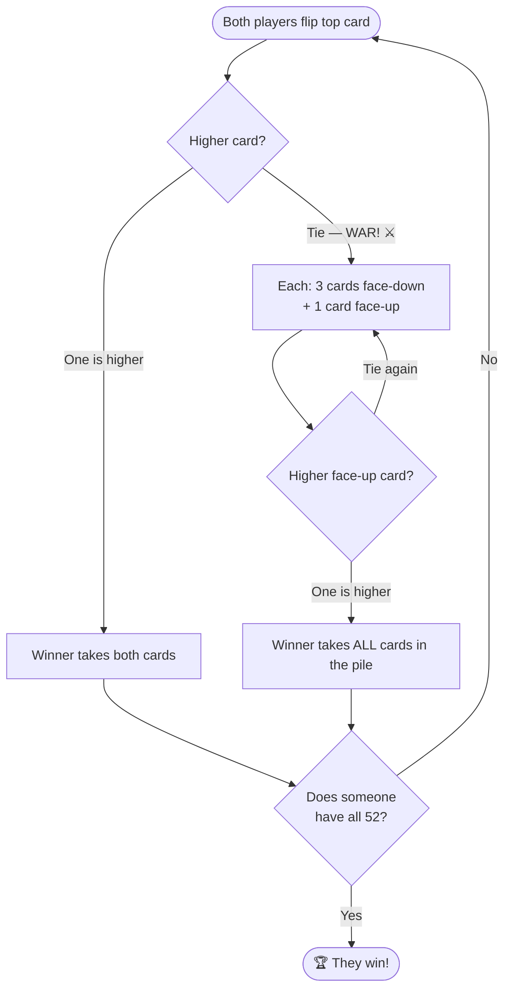

# ⚔️ War

> The simplest card game ever. Pure luck. Great with kids — or when you're too tired to think.

<div align="center">

| 👥 Players | 🃏 Deck | ⏱️ Time | ⭐ Difficulty |
|:----------:|:------:|:------:|:------------:|
| 2 | 52 cards | 10–30 min | Easy |

</div>

---

## 🎯 Goal

**Win all 52 cards.** Or, more realistically, until someone gives up.

---

## 🃏 Setup

1. Split the deck evenly — **26 cards each**, face-down.
2. Don't look at them.

---

## 🎮 How to Play

Both players flip the top card of their pile **at the same time**:

- 🏆 **Higher card wins** both cards. Put them at the bottom of your stack.
- ⚔️ **Tie? It's WAR!**

### How War Works

1. Each player places **3 cards face-down**.
2. Then flips a **4th card face-up**.
3. Higher face-up card wins **all 10 cards** in the pile.
4. Another tie? Another war (3 down, 1 up) — stack the prizes!

```
   Player A:  [4♦]  vs  Player B:  [J♠]   →  B wins both cards
   Player A:  [Q♥]  vs  Player B:  [Q♣]   →  WAR! ⚔️
              ↓ 3 face-down + 1 face-up each
              [?][?][?][9♠]   vs   [?][?][?][K♦]   →  B wins all 10
```

### 🔄 Game Flow



---

## 🏁 Game End

Game ends when one player has all 52 cards.

> ⚠️ Games can drag on forever. Common fix: play to a time limit, or "whoever has more cards after 15 minutes."

---

## 💡 "Strategy" Tips

There is no strategy. It's 100% luck. Embrace it.

- 🎲 Cheer dramatically on every flip
- ⚔️ War is the fun part — make it loud

---

## 👶 Great For

Kids learning card ranks, killing 10 minutes, or anyone who just wants to flip cards without thinking.

---

[← Back to all games](../README.md)
